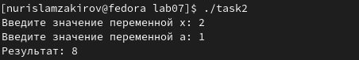

---
## Front matter
title: "Отчет по лабораторной работе №7"
subtitle: "Дисциплина: архитектура компьютера"
author: "Закиров Нурислам Дамирович"

## Generic otions
lang: ru-RU
toc-title: "Содержание"

## Bibliography
bibliography: bib/cite.bib
csl: pandoc/csl/gost-r-7-0-5-2008-numeric.csl

## Pdf output format
toc: true # Table of contents
toc-depth: 2
lof: true # List of figures
fontsize: 12pt
linestretch: 1.5
papersize: a4
documentclass: scrreprt
## I18n polyglossia
polyglossia-lang:
  name: russian
  options:
	- spelling=modern
	- babelshorthands=true
polyglossia-otherlangs:
  name: english
## I18n babel
babel-lang: russian
babel-otherlangs: english
## Fonts
mainfont: PT Serif
romanfont: PT Serif
sansfont: PT Sans
monofont: PT Mono
mainfontoptions: Ligatures=TeX
romanfontoptions: Ligatures=TeX
sansfontoptions: Ligatures=TeX,Scale=MatchLowercase
monofontoptions: Scale=MatchLowercase,Scale=0.9
## Biblatex
biblatex: true
biblio-style: "gost-numeric"
biblatexoptions:
  - parentracker=true
  - backend=biber
  - hyperref=auto
  - language=auto
  - autolang=other*
  - citestyle=gost-numeric
## Pandoc-crossref LaTeX customization
figureTitle: "Рис."
listingTitle: "Листинг"
lofTitle: "Список иллюстраций"
lolTitle: "Листинги"
## Misc options
indent: true
header-includes:
  - \usepackage{indentfirst}
  - \usepackage{float} # keep figures where there are in the text
  - \floatplacement{figure}{H} # keep figures where there are in the text
---

# Цель работы

Изучение команд условного и безусловного переходов. Освоение навыков написания
программ с использованием переходов. Знакомство с назначением и структурой файла
листинга.

# Задание

1. Реализация переходов в NASM.
2. Изучение структуры файлы листинга.
3. Задания для самостоятельной работы.

# Теоретическое введение

Для реализации ветвлений в ассемблере используются так называемые команды передачи
управления или команды перехода. Можно выделить 2 типа переходов:

• условный переход – выполнение или не выполнение перехода в определенную точку
программы в зависимости от проверки условия.

• безусловный переход – выполнение передачи управления в определенную точку программы без каких-либо условий.

Безусловный переход выполняется инструкцией jmp. Инструкция cmp является одной из инструкций, которая позволяет сравнить операнды и
выставляет флаги в зависимости от результата сравнения.
Инструкция cmp является командой сравнения двух операндов и имеет такой же формат,
как и команда вычитания.

Листинг (в рамках понятийного аппарата NASM) — это один из выходных файлов, создаваемых транслятором. Он имеет текстовый вид и нужен при отладке программы, так как
кроме строк самой программы он содержит дополнительную информацию.

# Выполнение лабораторной работы

## **Реализация переходов в NASM**

Создаю каталог для программ лабораторной работы № 7, перехожу в него и создаю файл lab7-1.asm. (рис. @fig:001).

{#fig:001 width=70%}

Ввожу в файл lab7-1.asm текст программы из листинга 7.1. (рис. @fig:002).

{#fig:002 width=70%}

Создаю исполняемый файл и запускаю его. (рис. @fig:003).

{#fig:003 width=70%}

Таким образом, использование инструкции jmp _label2 меняет порядок исполнения инструкций и позволяет выполнять инструкции начиная с метки _label2, не пропустив вывод первого сообщения.

Измените программу таким образом, чтобы она выдавала сначала «Сообщение No 2», а затем «Сообщение No 1», чтобы завершить процесс. Для достижения этой цели изменяю код программы в соответствии с листингом 7.2. (рис. @fig:004).

{#fig:004 width=70%}

Создаю исполняемый файл и проверяю его работу. (рис. @fig:005).

{#fig:005 width=70%}

Следующим шагом я изменяю текст программы, добавив jmp _label3 в начале программы, jmp _label2 в конце метки jmp _label3, jmp _label1 в конце метки jmp _label2 и jmp _end в конце метки jmp _label1. (рис. @fig:006).

{#fig:006 width=70%}

Для того, чтобы вывод программы был следующим: (рис. @fig:007).

{#fig:007 width=70%}

Рассмотрим программу, которая находит и показывает наибольшую из трех целочисленных переменных (A, B и C). Значения A и C задаются программой, а значение B вводится с клавиатуры.

Создаю файл lab7-2.asm (рис. @fig:008).

{#fig:008 width=70%}

Текст программы из листингая ввожу в lab7-2.asm. (рис. @fig:009).

{#fig:009 width=70%}

Создаю исполняемый файл и проверяю его работу. (рис. @fig:010).

{#fig:010 width=70%}

Файл работает корректно.

## **Изучение структуры файлы листинга**

Создаю файл листинга для программы из файла lab7-2.asm. (рис. @fig:011).

{#fig:011 width=70%}

Открываю файл листинга lab7-2.lst с помощью текстового редактора и изучаю его содержимое. (рис. @fig:012).

{#fig:012 width=70%}

В представленных трех строчках представлены данные: (рис. @fig:013).

{#fig:013 width=70%}

"2" - номер строки кода, "; Функция вычисления длинны сообщения" - комментарий к коду, не имеет адреса и машинного кода.

"3" - номер строки кода, "slen" - название функции, не имеет адреса и машинного кода.

"4" - номер строки кода, "00000000" - адрес строки, "53" - машинный код, "push ebx" - исходный текст программы, инструкция "push" помещает операнд "ebx" в стек.

Удаляю выделенный операнд из выбранной мной инструкции с двумя операндами в файле lab7-2.asm, который я открыл (рис. @fig:014).

{#fig:014 width=70%}

Выполняю трансляцию с получением файла листинга. (рис. @fig:015).

{#fig:015 width=70%}

На выходе я не получаю ни одного файла из-за ошибки:инструкция mov 
(единственная в коде содержит два операнда) не может работать, имея только один операнд, из-за чего нарушается работа кода.

## **Задания для самостоятельной работы**

1. Пишу программу нахождения наименьшей из 3 целочисленных переменных a, b и c.
Значения переменных выбираю из табл. 7.5 в соответствии с вариантом, полученным
при выполнении лабораторной работы № 6. Мой вариант под номером 1, поэтому мои значения - 17, 23 и 45. (рис. @fig:016).

{#fig:016 width=70%}

Создаю исполняемый файл и проверяю его работу, подставляя необходимые значение. (рис. @fig:017).

{#fig:017 width=70%}

Программа работает корректно.

Код программы:

```NASM
%include 'in_out.asm'

section .data

msg db "Наименьшее число: ",0h

A dd '17'

B dd '23'

C dd '45'

section .bss

min resb 10

section .text

global _start

_start:

; ---------- Записываем 'A' в переменную 'min'

mov ecx,[A] ; 'ecx = A'

mov [min],ecx ; 'min = A'

; ---------- Сравниваем 'A' и 'С' (как символы)

cmp ecx,[C] ; Сравниваем 'A' и 'С'

jg check_B

mov ecx,[C] ; иначе 'ecx = C'

mov [min],ecx ; 'min = C'

; ---------- Преобразование 'min(A,C)' из символа в число

check_B:

mov eax,min

call atoi ; Вызов подпрограммы перевода символа в число

mov [min],eax ; запись преобразованного числа в `min`

; ---------- Сравниваем 'min(A,C)' и 'B' (как числа)

mov ecx,[min]

cmp ecx,[B] ; Сравниваем 'min(A,C)' и 'B'

jl fin ; если 'min(A,C)<B', то переход на 'fin',

mov ecx,[B] ; иначе 'ecx = B'

mov [min],ecx

; ---------- Вывод результата

fin:

mov eax, msg

call sprint ; Вывод сообщения 'Наименьшее число: '

mov eax,[min]

call iprintLF ; Вывод 'min(A,B,C)'

call quit ; Выход
```

2. Пишу программу, которая для введенных с клавиатуры значений х и а вычисляет
значение и выводит результат вычислений заданной для моего варианта функции f(x):

2*a - x, если х < a

8, если х >= a

(рис. @fig:018).

{#fig:018 width=70%}

Создаю исполняемый файл и проверяю его работу для значений х и а соответственно: (1;2), (2;1). (рис. @fig:019 , @fig:020).

{#fig:019 width=70%}

{#fig:020 width=70%}

Программа работает корректно.

Код программы:
```NASM
%include 'in_out.asm' ; подключение внешнего файла

SECTION .data ; секция инициированных данных
msg1: DB 'Введите значение переменной х: ',0
msg2: DB 'Введите значение переменной a: ',0
rem: DB 'Результат: ',0

SECTION .bss ; секция не инициированных данных

x: RESB 80 ; Переменная, чьё значение будем вводить с клавиатуры, выделенный размер - 80 байт
a: RESB 80 ; Переменная, чьё значение будем вводить с клавиатуры, выделенный размер - 80 байт
SECTION .text ; Код программы
GLOBAL _start ; Начало программы
_start: ; Точка входа в программу

mov eax, msg1 ; запись адреса выводимиого сообщения в eax
call sprint ; вызов подпрограммы печати сообщения
mov ecx, x ; запись адреса переменной в ecx
mov edx, 80 ; запись длины вводимого значения в edx
call sread ; вызов подпрограммы ввода сообщения
mov eax,x; вызов подпрограммы преобразования
call atoi ; ASCII кода в число, eax=x
mov [x],eax
mov eax, msg2 ; запись адреса выводимиого сообщения в eax
call sprint ; вызов подпрограммы печати сообщения
mov ecx,a ; запись адреса переменной в ecx
mov edx, 85 ; запись длины вводимого значения в edx
call sread ; вызов подпрограммы ввода сообщения
mov eax,a ; вызов подпрограммы преобразования
call atoi ; ASCII кода в число, eax=x
mov [a],eax
;------------
cmp eax,[x] ; Сравниваем 'x' и 'a'
jb check_B ; если 'x<a', то переход на метку 'check_B',
jae check_A
;------------
check_A:
mov eax,[a]
shl eax,1
sub eax,[x]; eax =2a - x 
mov edi,eax ; запись результата вычисления в 'edi'
jmp _end
;------------
check_B: ;
mov edi,8 ; запись результата вычисления в 'edi'
jmp _end
; ---- Вывод результата на экран
_end:
mov eax,rem ; вызов подпрограммы печати
call sprint ; сообщения 'Результат: '
mov eax,edi ; вызов подпрограммы печати значения
call iprintLF ; из 'edi' в виде символов
call quit ; вызов подпрограммы завершения
```
# Выводы

По завершении этой лабораторной работы я научился использовать команды условного и безусловного перехода, овладел навыками написания программ с использованием этих переходов и узнал о целях и структуре файла листинга. Все это поможет мне в выполнении следующих лабораторных работ.

# Список литературы

1. GDB: The GNU Project Debugger. — URL: https://www.gnu.org/software/gdb/.
2. GNU Bash Manual. — 2016. — URL: https://www.gnu.org/software/bash/manual/.
3. Midnight Commander Development Center. — 2021. — URL: https://midnight-commander.
org/.
4. NASM Assembly Language Tutorials. — 2021. — URL: https://asmtutor.com/.
5. Newham C. Learning the bash Shell: Unix Shell Programming. — O’Reilly Media, 2005. —
354 с. — (In a Nutshell). — ISBN 0596009658. — URL: http://www.amazon.com/Learningbash-Shell-Programming-Nutshell/dp/0596009658.
6. Robbins A. Bash Pocket Reference. — O’Reilly Media, 2016. — 156 с. — ISBN 978-1491941591.
7. The NASM documentation. — 2021. — URL: https://www.nasm.us/docs.php.
8. Zarrelli G. Mastering Bash. — Packt Publishing, 2017. — 502 с. — ISBN 9781784396879.
9. Колдаев В. Д., Лупин С. А. Архитектура ЭВМ. — М. : Форум, 2018.
10. Куляс О. Л., Никитин К. А. Курс программирования на ASSEMBLER. — М. : Солон-Пресс, 2017.
11. Новожилов О. П. Архитектура ЭВМ и систем. — М. : Юрайт, 2016.
12. Расширенный ассемблер: NASM. — 2021. — URL: https://www.opennet.ru/docs/RUS/nasm/.
13. Робачевский А., Немнюгин С., Стесик О. Операционная система UNIX. — 2-е изд. — БХВПетербург, 2010. — 656 с. — ISBN 978-5-94157-538-1.
14. Столяров А. Программирование на языке ассемблера NASM для ОС Unix. — 2-е изд. —
М. : МАКС Пресс, 2011. — URL: http://www.stolyarov.info/books/asm_unix.
15. Таненбаум Э. Архитектура компьютера. — 6-е изд. — СПб. : Питер, 2013. — 874 с. —
(Классика Computer Science).
16. Таненбаум Э., Бос Х. Современные операционные системы. — 4-е изд. — СПб. : Питер,2015. — 1120 с. — (Классика Computer Science).
