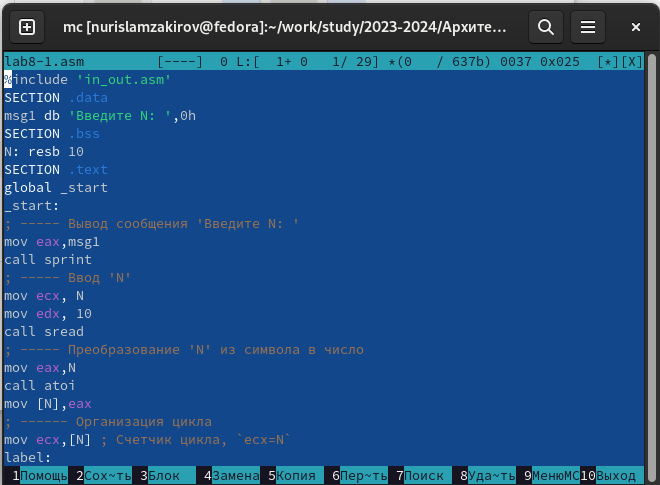
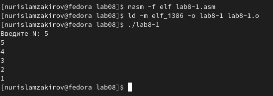
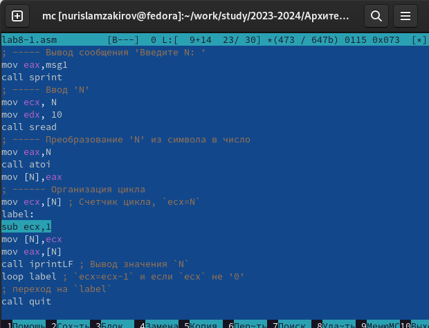
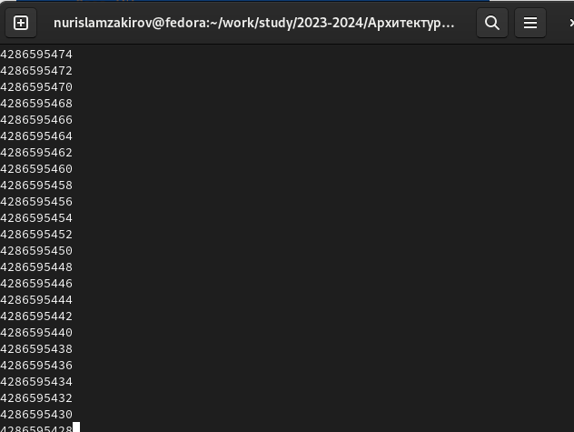
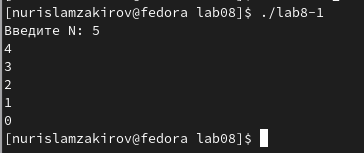
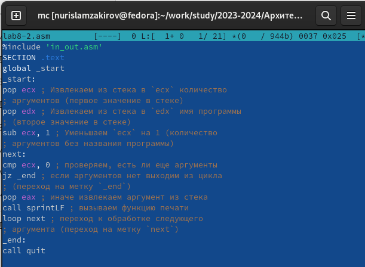
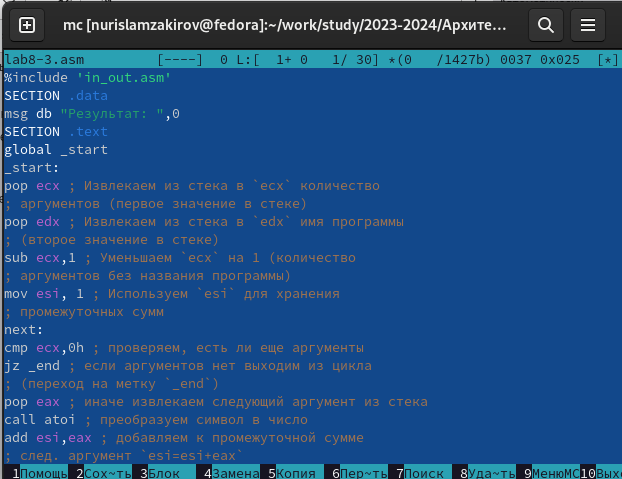
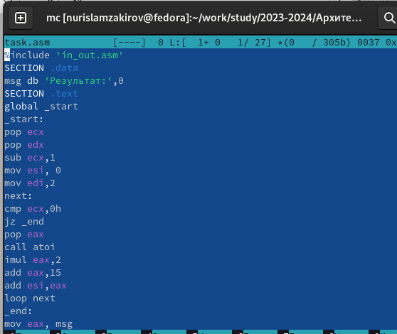

---
## Front matter
title: "Отчёт по лабораторной работе №8"
subtitle: "Дисциплина: архитектура компьютеров и операционные системы"
author: "Закиров Нурислам Дамирович"

## Generic otions
lang: ru-RU
toc-title: "Содержание"

## Bibliography
bibliography: bib/cite.bib
csl: pandoc/csl/gost-r-7-0-5-2008-numeric.csl

## Pdf output format
toc: true # Table of contents
toc-depth: 2
lof: true # List of figures
lot: true # List of tables
fontsize: 12pt
linestretch: 1.5
papersize: a4
documentclass: scrreprt
## I18n polyglossia
polyglossia-lang:
  name: russian
  options:
	- spelling=modern
	- babelshorthands=true
polyglossia-otherlangs:
  name: english
## I18n babel
babel-lang: russian
babel-otherlangs: english
## Fonts
mainfont: PT Serif
romanfont: PT Serif
sansfont: PT Sans
monofont: PT Mono
mainfontoptions: Ligatures=TeX
romanfontoptions: Ligatures=TeX
sansfontoptions: Ligatures=TeX,Scale=MatchLowercase
monofontoptions: Scale=MatchLowercase,Scale=0.9
## Biblatex
biblatex: true
biblio-style: "gost-numeric"
biblatexoptions:
  - parentracker=true
  - backend=biber
  - hyperref=auto
  - language=auto
  - autolang=other*
  - citestyle=gost-numeric
## Pandoc-crossref LaTeX customization
figureTitle: "Рис."
tableTitle: "Таблица"
listingTitle: "Листинг"
lofTitle: "Список иллюстраций"
lotTitle: "Список таблиц"
lolTitle: "Листинги"
## Misc options
indent: true
header-includes:
  - \usepackage{indentfirst}
  - \usepackage{float} # keep figures where there are in the text
  - \floatplacement{figure}{H} # keep figures where there are in the text
---

# Цель работы

Приобретение навыков написания программ с использованием циклов и обработкой аргументов командной строки.

# Задание

1. Реализация циклов в NASM.

2. Обработка аргументов командной строки.

3. Задание для самостоятельной работы.

# Теоретическое введение

Стек — это структура данных, организованная по принципу LIFO («Last In — First Out»
или «последним пришёл — первым ушёл»). Стек является частью архитектуры процессора и
реализован на аппаратном уровне. Для работы со стеком в процессоре есть специальные
регистры (ss, bp, sp) и команды.
Основной функцией стека является функция сохранения адресов возврата и передачи
аргументов при вызове процедур. Кроме того, в нём выделяется память для локальных
переменных и могут временно храниться значения регистров.
Стек имеет вершину, адрес последнего добавленного элемента, который хранится в регистре esp (указатель стека). Противоположный конец стека называется дном. Значение, помещённое в стек последним, извлекается первым. При помещении значения в стек указатель стека уменьшается, а при извлечении — увеличивается.

Команда push размещает значение в стеке, т.е. помещает значение в ячейку памяти, на
которую указывает регистр esp, после этого значение регистра esp увеличивается на 4.
Данная команда имеет один операнд — значение, которое необходимо поместить в стек.

Команда pop извлекает значение из стека, т.е. извлекает значение из ячейки памяти, на
которую указывает регистр esp, после этого уменьшает значение регистра esp на 4. У этой
команды также один операнд, который может быть регистром или переменной в памяти.
Нужно помнить, что извлечённый из стека элемент не стирается из памяти и остаётся как
“мусор”, который будет перезаписан при записи нового значения в стек.

Для организации циклов существуют специальные инструкции. Для всех инструкций
максимальное количество проходов задаётся в регистре ecx. Наиболее простой является инструкция loop. Она позволяет организовать безусловный цикл.

# Выполнение лабораторной работы

## **Реализация циклов в NASM**

Создаю каталог для программ лабораторной работы № 8, перехожу в него и создаю файл lab8-1.asm. (рис. @fig:001).

{#fig:001 width=70%}

Ввожу в файл lab8-1.asm текст программы из листинга 8.1. (рис. @fig:002).

{#fig:002 width=70%}

Создаю исполняемый файл и проверяю его работу. (рис. @fig:003).

{#fig:003 width=70%}

Данная программа выводит числа от N до 1 включительно. 

Изменяю текст программы, добавив изменение значения регистра ecx в цикле. (рис. @fig:004).

{#fig:004 width=70%}

Создаю исполняемый файл и проверяю его работу. (рис. @fig:005).

{#fig:005 width=70%}

В данном случае число проходов цикла не соответствует введенному с клавиатуры значению.

Вношу изменения в текст программы, добавив команды push и pop для сохранения значения счетчика цикла loop. (рис. @fig:006).

{#fig:006 width=70%}

Создаю исполняемый файл и проверяю его работу.(рис. @fig:007).

{#fig:007 width=70%}

В данном случае число проходов цикла соответствует введенному с клавиатуры значению и выводит числа от N-1 до 0 включительно. 

## **Обработка аргументов командной строки**

Создаю файл lab8-2.asm и ввожу в него текст программы из листинга 8.2. (рис. @fig:008).

{#fig:008 width=70%}

Создаю исполняемый файл и запускаю его, указав нужные аргументы. (рис. @fig:009).

{#fig:009 width=70%}

Программа вывела 4 аргумента, так как аргумент 2 не взят в кавычки, в отличии от аргумента 3, поэтому из-за пробела программа считывает "2" как отдельный аргумент.

Рассмотрим пример программы, которая выводит сумму чисел, которые передаются в программу как аргументы. Создаю файл lab8-3.asm и ввожу в него текст программы из листинга 8.3. (рис. @fig:010).

{#fig:010 width=70%}

Создаю исполняемый файл и запускаю его, указав аргументы. (рис. @fig:011).

{#fig:011 width=70%}

Изменяю текст программы из листинга 8.3 для вычисления произведения аргументов
командной строки. (рис. @fig:012).

{#fig:012 width=70%}

Создаю исполняемый файл и запускаю его, указав аргументы. (рис. @fig:013).

{#fig:013 width=70%}

## **Задание для самостоятельной работы**

Пишу текст программы, которая находит сумму значений функции f(x) = 2*x + 15) в соответствии с моим номером варианта (1) для x = x1, x2, ..., xn. Значения xi передаются как аргументы. (рис. @fig:014).

{#fig:014 width=70%}

Создаю исполняемый файл и проверьте его работу на нескольких наборах x = x1, x2, ..., xn. (рис. @fig:015).

{#fig:015 width=70%}

Программа работает корректно.

Текст программы:

```

%include 'in_out.asm'
SECTION .data
msg db 'Результат:',0
SECTION .text
global _start
_start:
pop ecx
pop edx
sub ecx,1
mov esi, 0
mov edi,2
next:
cmp ecx,0h
jz _end
pop eax
call atoi
imul eax,2
add eax,15
add esi,eax
loop next
_end:
mov eax, msg
call sprint
mov eax, esi
call iprintLF
call quit

```

# Выводы

Я приобрел навыки написания программ с использованием циклов и обработки аргументов командной строки благодаря этой лабораторной работе. Эти навыки будут полезны для моих последующих лабораторных работ.

# Список литературы

1. GDB: The GNU Project Debugger. — URL: https://www.gnu.org/software/gdb/.
2. GNU Bash Manual. — 2016. — URL: https://www.gnu.org/software/bash/manual/.
3. Midnight Commander Development Center. — 2021. — URL: https://midnight-commander.
org/.
4. NASM Assembly Language Tutorials. — 2021. — URL: https://asmtutor.com/.
5. Newham C. Learning the bash Shell: Unix Shell Programming. — O’Reilly Media, 2005 — 354 с. — (In a Nutshell). — ISBN 0596009658. — URL: http://www.amazon.com/Learningbash-Shell-Programming-Nutshell/dp/0596009658.
6. Robbins A. Bash Pocket Reference. — O’Reilly Media, 2016. — 156 с. — ISBN 978-1491941591.
7. The NASM documentation. — 2021. — URL: https://www.nasm.us/docs.php.
8. Zarrelli G. Mastering Bash. — Packt Publishing, 2017. — 502 с. — ISBN 9781784396879.
9. Колдаев В. Д., Лупин С. А. Архитектура ЭВМ. — М. : Форум, 2018.
10. Куляс О. Л., Никитин К. А. Курс программирования на ASSEMBLER. — М. : Солон-Пресс, 2017.
11. Новожилов О. П. Архитектура ЭВМ и систем. — М. : Юрайт, 2016.
12. Расширенный ассемблер: NASM. — 2021. — URL: https://www.opennet.ru/docs/RUS/nasm/.
13. Робачевский А., Немнюгин С., Стесик О. Операционная система UNIX. — 2-е изд. — БХВПетербург, 2010. — 656 с. — ISBN 978-5-94157-538-1.
14. Столяров А. Программирование на языке ассемблера NASM для ОС Unix. — 2-е изд. —
М. : МАКС Пресс, 2011. — URL: http://www.stolyarov.info/books/asm_unix.
15. Таненбаум Э. Архитектура компьютера. — 6-е изд. — СПб. : Питер, 2013. — 874 с. —
(Классика Computer Science).
16. Таненбаум Э., Бос Х. Современные операционные системы. — 4-е изд. — СПб. : Питер,2015. — 1120 с. — (Классика Computer Science).
