---
## Front matter
title: "Отчёт по лабораторной работе 9"
subtitle: "Дисциплина: архитектура компьютера"
author: "Закиров Нурислам Дамирович"

## Generic otions
lang: ru-RU
toc-title: "Содержание"

## Bibliography
bibliography: bib/cite.bib
csl: pandoc/csl/gost-r-7-0-5-2008-numeric.csl

## Pdf output format
toc: true # Table of contents
toc-depth: 2
lof: true # List of figures
lot: true # List of tables
fontsize: 12pt
linestretch: 1.5
papersize: a4
documentclass: scrreprt
## I18n polyglossia
polyglossia-lang:
  name: russian
  options:
	- spelling=modern
	- babelshorthands=true
polyglossia-otherlangs:
  name: english
## I18n babel
babel-lang: russian
babel-otherlangs: english
## Fonts
mainfont: PT Serif
romanfont: PT Serif
sansfont: PT Sans
monofont: PT Mono
mainfontoptions: Ligatures=TeX
romanfontoptions: Ligatures=TeX
sansfontoptions: Ligatures=TeX,Scale=MatchLowercase
monofontoptions: Scale=MatchLowercase,Scale=0.9
## Biblatex
biblatex: true
biblio-style: "gost-numeric"
biblatexoptions:
  - parentracker=true
  - backend=biber
  - hyperref=auto
  - language=auto
  - autolang=other*
  - citestyle=gost-numeric
## Pandoc-crossref LaTeX customization
figureTitle: "Рис."
tableTitle: "Таблица"
listingTitle: "Листинг"
lofTitle: "Список иллюстраций"
lotTitle: "Список таблиц"
lolTitle: "Листинги"
## Misc options
indent: true
header-includes:
  - \usepackage{indentfirst}
  - \usepackage{float} # keep figures where there are in the text
  - \floatplacement{figure}{H} # keep figures where there are in the text
---

# Цель работы

Цель работы состоит в том, чтобы приобрести навыки разработки программ с использованием подпрограмм и приобретение
знание методов отладки с помощью GDB и его основных возможностей.

# Выполнение лабораторной работы

## Реализация подпрограмм в NASM

Я создал новую директорию и перешел в нее, чтобы выполнить лабораторную работу номер 9. 
Затем я создал файл lab9-1.asm.

Рассмотрим программу, которая вычисляет арифметическое. 
Подпрограмма для расчета используется для получения выражения $f(x) = 2x+7$. 
В этом примере переменная $x$ вводится с клавиатуры. 
а сама формула вычисляется в рамках подпрограммы.(рис. [-@fig:001]) (рис. [-@fig:002])

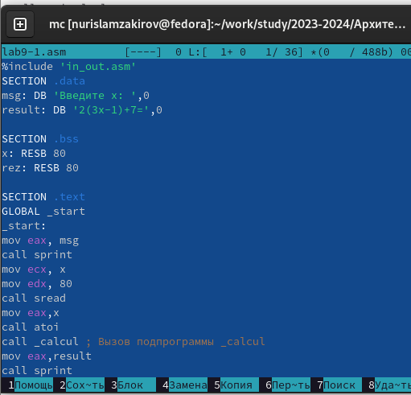{ #fig:001 width=70%, height=70% }

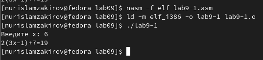{ #fig:002 width=70%, height=70% }

Следующим шагом было включение подпрограммы subcalcul в подпрограмму calcul и внесение изменений в текст программы. Это позволяет вычислить составное выражение $f(g(x))$, в котором также вводится значение $x$ с клавиатуры.  
Функции определены следующим образом: $f(x) = 2x + 7$, $g(x) = 3x - 1$.(рис. [-@fig:003]) (рис. [-@fig:004])

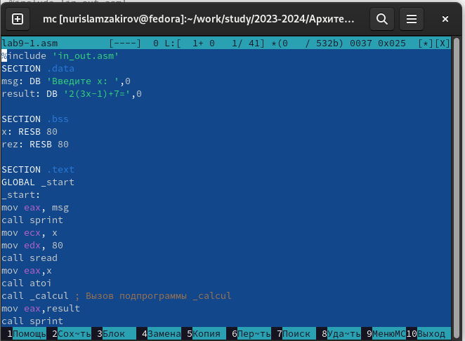{ #fig:003 width=70%, height=70% }

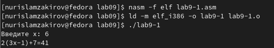{ #fig:004 width=70%, height=70% }

## Отладка программам с помощью GDB

Я создал файл с именем lab9-2.asm, в котором содержится текст программы из Листинга 9.2. 
Эта программа отвечает за печать сообщения "Hello world!".(рис. [-@fig:005])

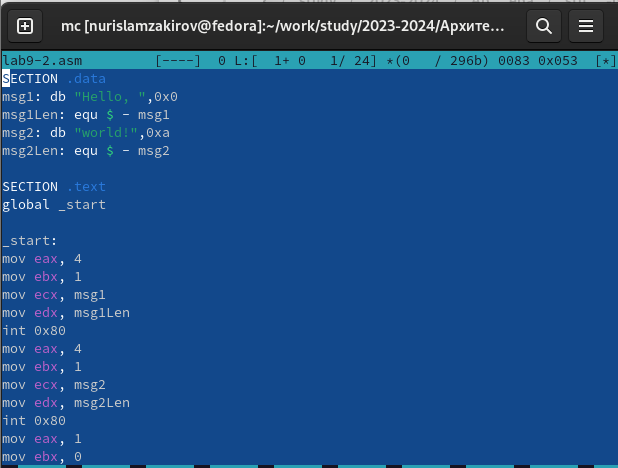{ #fig:005 width=70%, height=70% }

Следующим шагом я скомпилировал файл и получил исполняемый файл. Чтобы добавить отладочную 
информацию для работы с отладчиком GDB, использовал ключ "-g".

После чего я загрузил полученный исполняемый файл в отладчик GDB и 
проверил его работу, запустив программу с помощью команды "r". (рис. [-@fig:006])

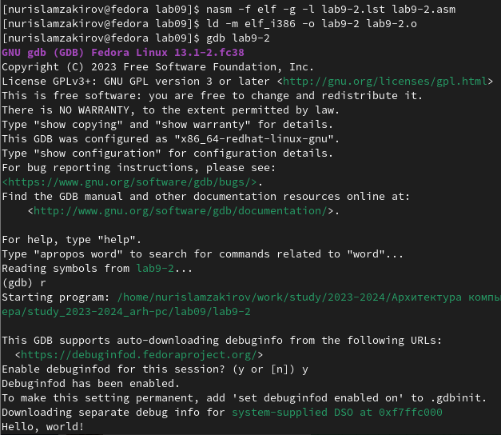{ #fig:006 width=70%, height=70% }

Чтобы провести более подробный анализ программы, я установил точку остановки на метке «start»
 и запустил ее. Затем я просмотрел дизассемблированный код программы.(рис. [-@fig:007]) (рис. [-@fig:008])

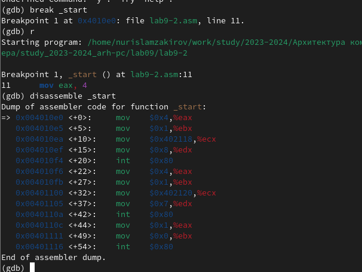{ #fig:007 width=70%, height=70% }

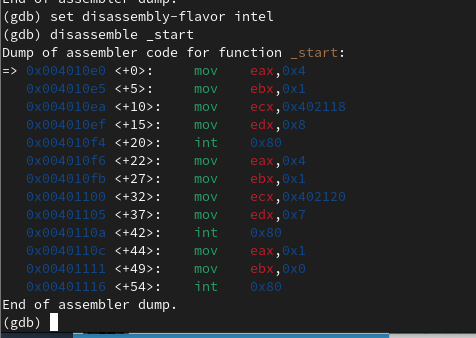{ #fig:008 width=70%, height=70% }

### Точки остановки

Я использовал команду «info breakpoints» или «i b», чтобы проверить точку остановки по имени метки «_start». Затем я установил еще одну точку остановки по адресу инструкции, определив адрес предыдущей инструкции «mov ebx, 0x0». (рис. [-@fig:009])

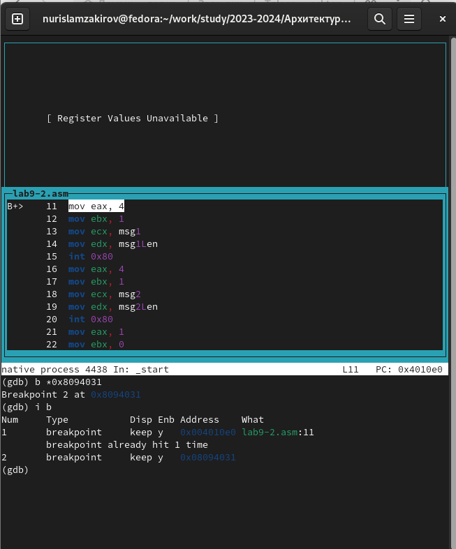{ #fig:009 width=70%, height=70% }

### Работа с данными программы в GDB

В отладчике GDB можно просматривать содержимое ячеек памяти и регистров, 
а также изменять значения регистров и переменных. Выполнил 5 инструкций с 
помощью команды 'si' и отследил изменение значений 
регистров. (рис. [-@fig:010]) (рис. [-@fig:011])

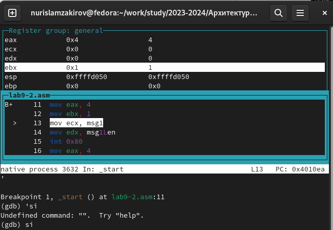{ #fig:010 width=70%, height=70% }

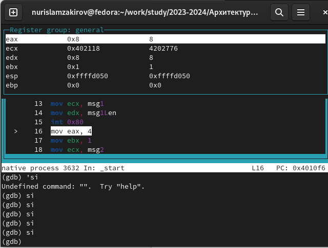{ #fig:011 width=70%, height=70% }

Просмотрел значение переменной msg1 по имени и получил нужные данные.

Команда set была использована для изменения значения ячейки памяти или регистра. 
указав в качестве аргумента имя регистра или адрес. 
изменил начало переменной msg1. (рис. [-@fig:012])(рис. [-@fig:013])

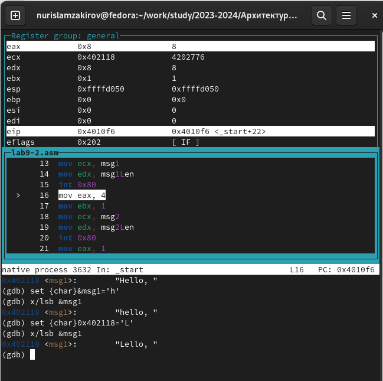{ #fig:012 width=70%, height=70% }

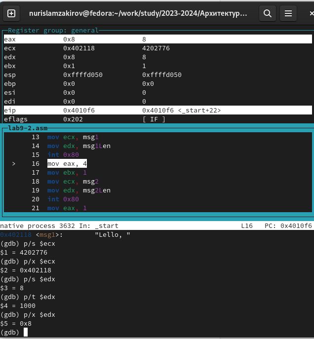{ #fig:013 width=70%, height=70% }

С помощью команды set изменил значение регистра ebx на нужное значение. (рис. [-@fig:014])

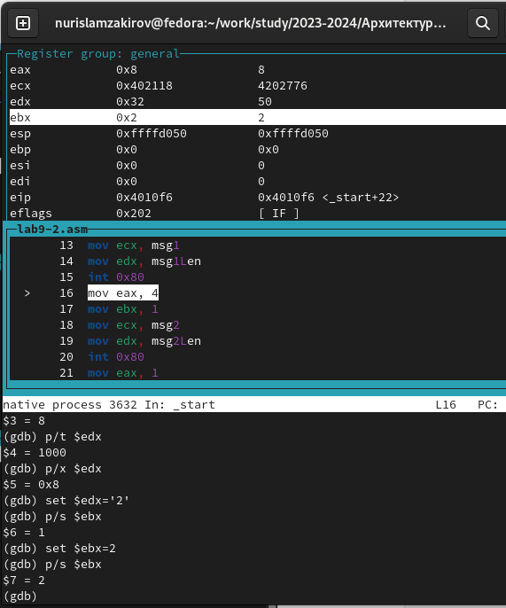{ #fig:014 width=70%, height=70% }

### Обработка аргументов командной строки в GDB

Скопировал файл lab8-2.asm, который был создан во время выполнения лабораторной работы номер 8, и он содержит программу, которая позволяет выводить аргументы командной строки. 
скопировал файл и создал исполняемый файл.

Используя ключ —args, можно загрузить программу с аргументами в gdb, а затем загрузить исполняемый файл в отладчик с этими аргументами.

Установил точку останова и запустил первую инструкцию программы.

В регистре esp хранится адрес вершины стека, который содержит количество аргументов командной строки, в том числе имя программы. По этой ссылке можно найти число, показывающее количество аргументов. В данном случае количество аргументов, включая имя программы lab9-3, а также сами аргументы: аргумент1, аргумент2 и «аргумент 3», видно.

Просмотрел остальные позиции стека. 
По адресу [esp+4] находится адрес в памяти, где располагается имя программы. 
По адресу [esp+8] хранится адрес первого аргумента, 
по адресу [esp+12] - второго и так далее. (рис. [-@fig:015])

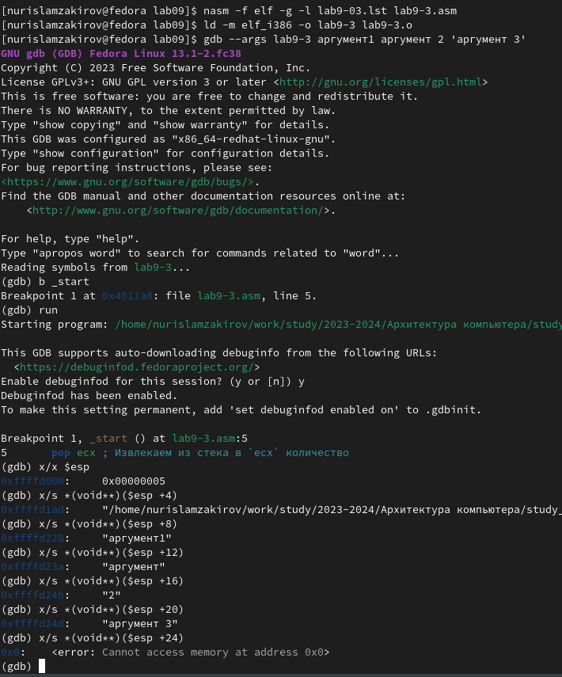{ #fig:015 width=70%, height=70% }

Шаг изменения адреса равен 4, так как каждый следующий адрес на стеке находится на расстоянии 4 байт от предыдущего ([esp+4], [esp+8], [esp+12]).

## Задание для самостоятельной работы

Изменил программы из лабораторной работы No8 (Задание No1 для самостоятельной работы), добавив подпрограмму для вычисления значения функции f(x).Мой вариант был 1. (рис. [-@fig:016]) (рис. [-@fig:017])

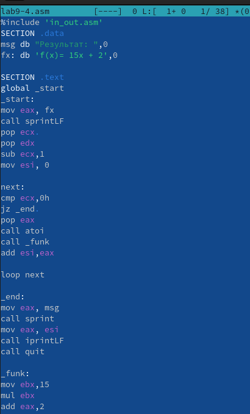{ #fig:016 width=70%, height=70% }

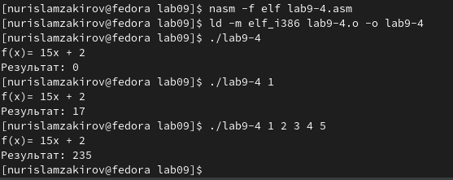{ #fig:017 width=70%, height=70% }

В листинге приведена программа вычисления выражения $(3+2)*4+5$. 
При запуске данная программа дает неверный результат. Проверил это, 
анализируя изменения значений регистров с помощью отладчика GDB. 

Определил ошибку - перепутан порядок аргументов у инструкции add. 
Также обнаружил, что по окончании работы в edi отправляется ebx вместо eax.(рис. [-@fig:018])

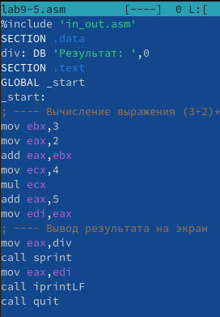{ #fig:018 width=70%, height=70% }

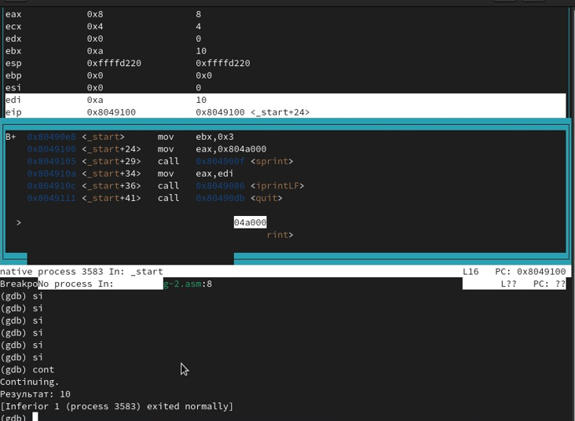{ #fig:019 width=70%, height=70% }

Отмечу, что перепутан порядок аргументов у инструкции add и что по окончании работы в edi 
отправляется ebx вместо eax (рис. [-@fig:019])

Исправленный код программы (рис. [-@fig:020]) (рис. [-@fig:021])

{ #fig:020 width=70%, height=70% }

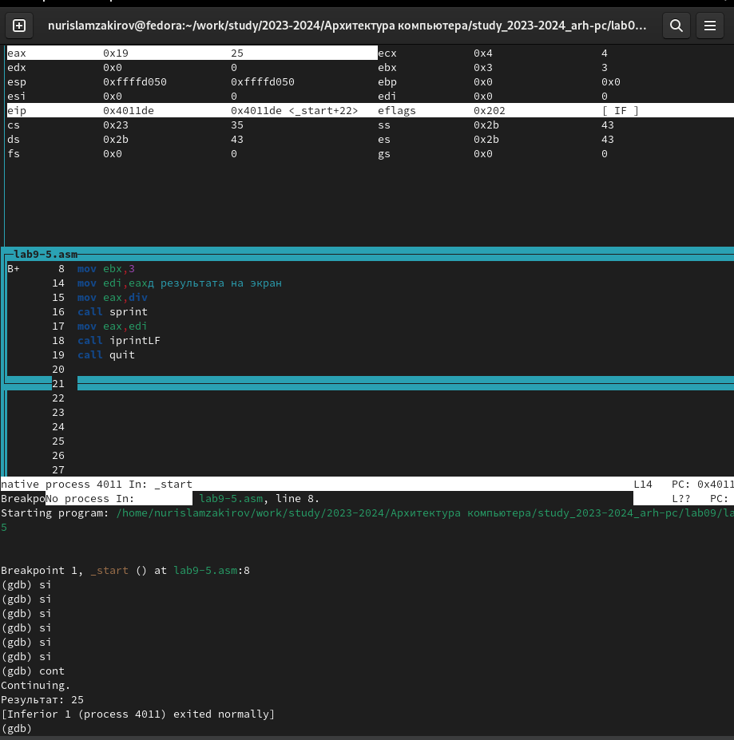{ #fig:021 width=70%, height=70% }

# Выводы

В ходе лаболаторной работы, я приобрел навыки разработки программ с использованием подпрограмм и
знание методов отладки с помощью GDB и его основных возможностей.
# Список литературы
1. [Лабораторная работа 9](https://esystem.rudn.ru/pluginfile.php/2089096/mod_resource/content/0/%D0%9B%D0%B0%D0%B1%D0%BE%D1%80%D0%B0%D1%82%D0%BE%D1%80%D0%BD%D0%B0%D1%8F%20%D1%80%D0%B0%D0%B1%D0%BE%D1%82%D0%B0%20%E2%84%969.%20%D0%9F%D0%BE%D0%BD%D1%8F%D1%82%D0%B8%D0%B5%20%D0%BF%D0%BE%D0%B4%D0%BF%D1%80%D0%BE%D0%B3%D1%80%D0%B0%D0%BC%D0%BC%D1%8B.%20%D0%9E%D1%82%D0%BB%D0%B0%D0%B4%D1%87%D0%B8%D0%BA%20..pdf)
